# Azrok's Republic — Digital Pass-and-Play Edition

> *Rules Version 1.4.2*

A digital adaptation of the social-deduction board game **Azrok's Republic**, built in Python with Tkinter. Two to eight players share one device, secretly working either to defend the Republic or to help the Drow invaders destroy it. AI-controlled player slots are available for solo play or mixed games.

---

## Requirements

| Requirement | Details |
|---|---|
| Python | 3.8+ |
| Tkinter | Bundled with most Python installs |
| OS | Windows (native), macOS, or Linux |

---

## Running the Game

**Windows — pre-built executable (no Python needed):**
```
build\AzroksRepublic.exe
```

**Windows — double-click launcher:**
```
play_azroks_republic.bat
```

**Any platform — command line:**
```bash
python azroks_republic.py
```

**Rebuild the executable after code changes:**
```
build_exe.bat
```

---

## Screenshots

### Setup
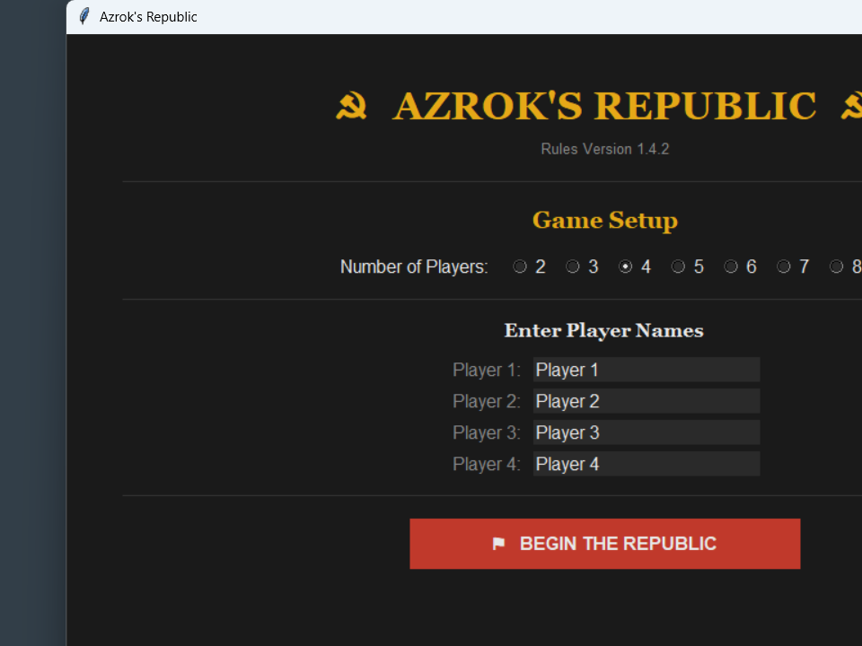

### Role Reveal
| Hidden | Revealed |
|---|---|
| 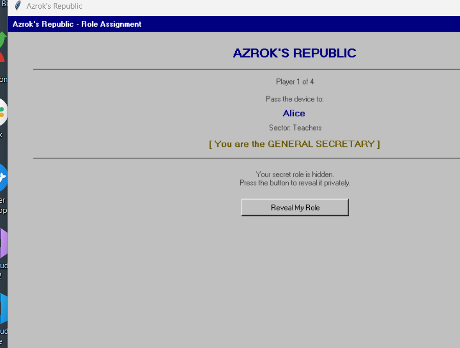 | 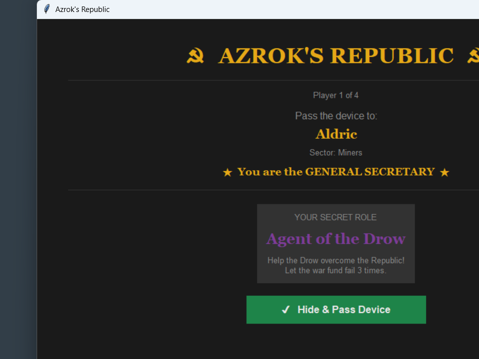 |

### Turn Start
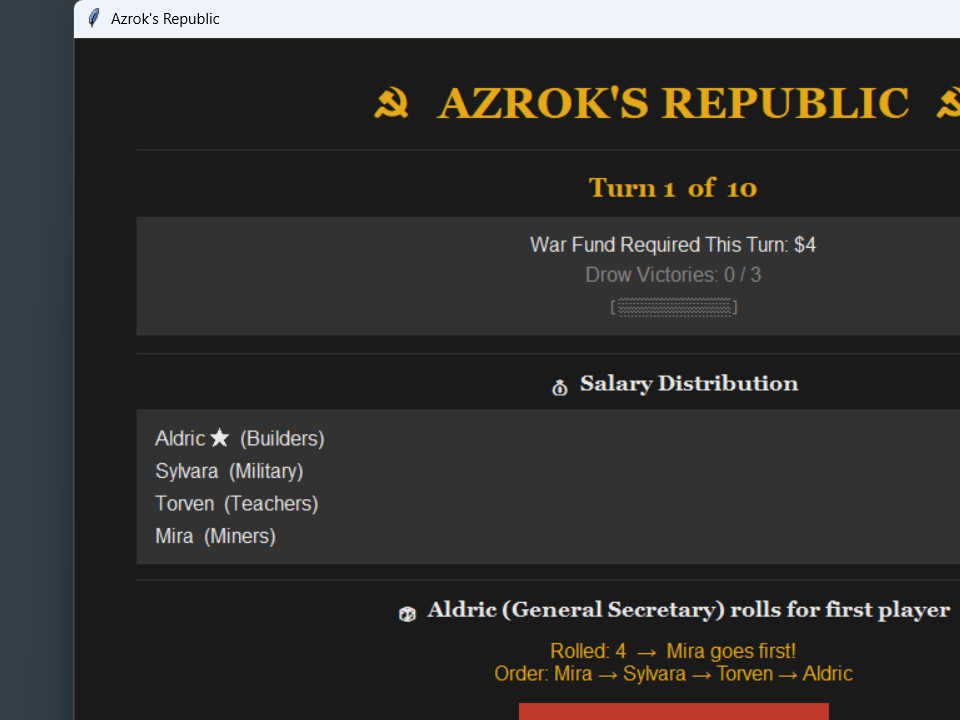

### Pass the Device
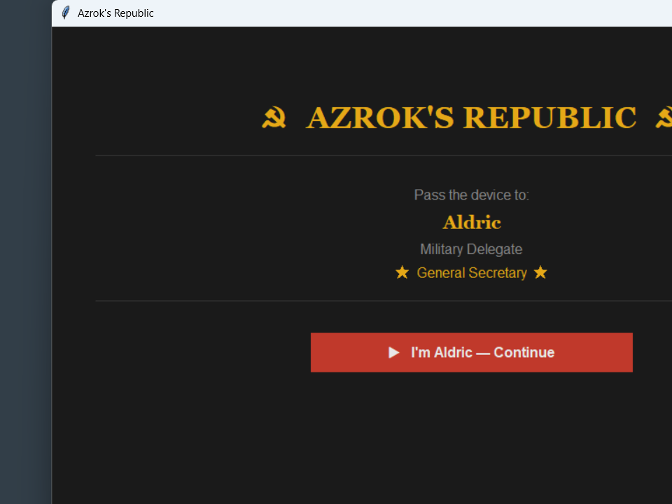

### Player Turn — People's Pot
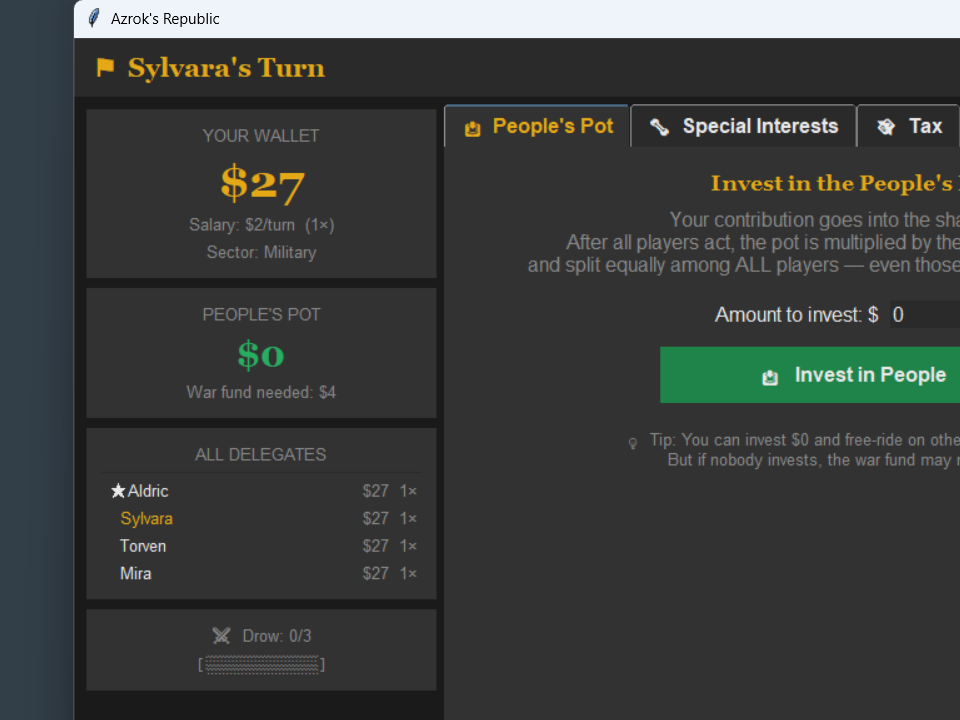

### Player Turn — Special Interests
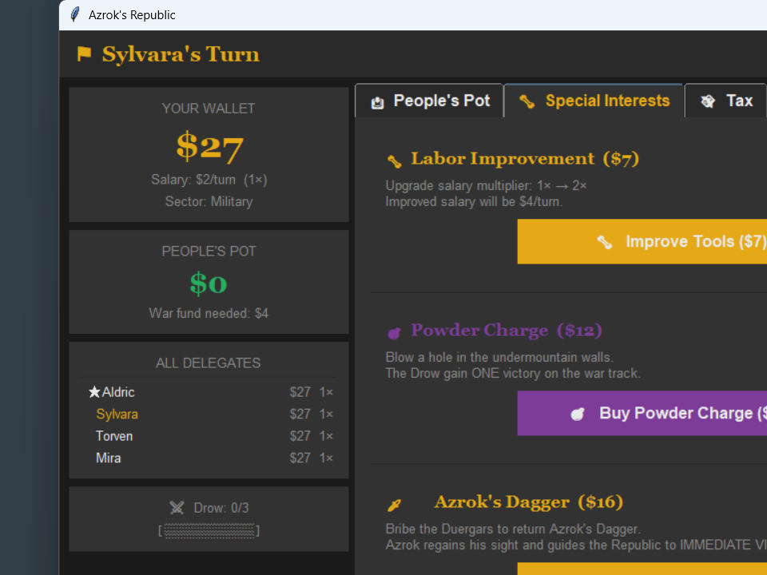

### Player Turn — Tax
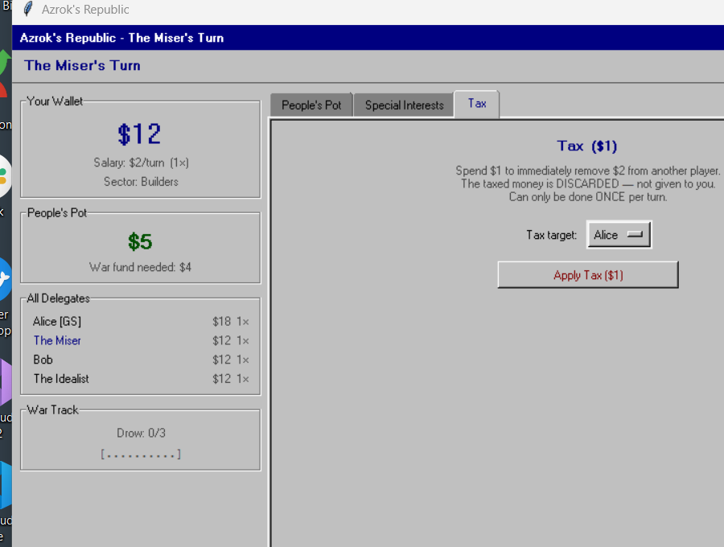

### End-of-Turn Resolution
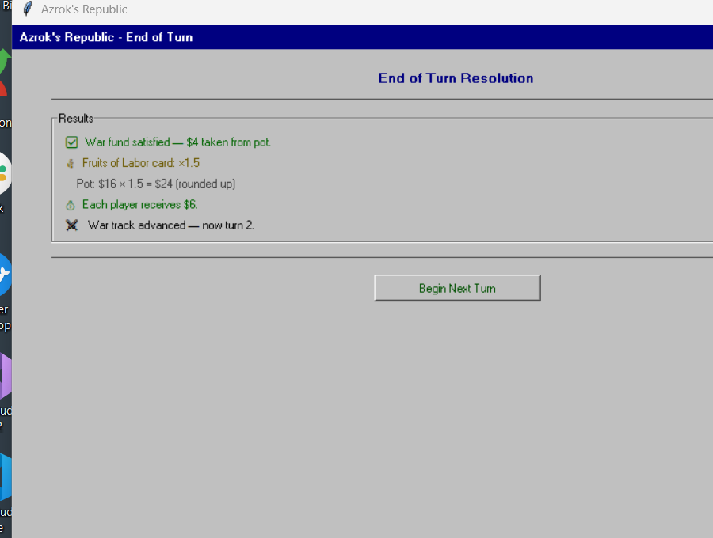

### Game Over
| Republic Wins | Drow Win |
|---|---|
| 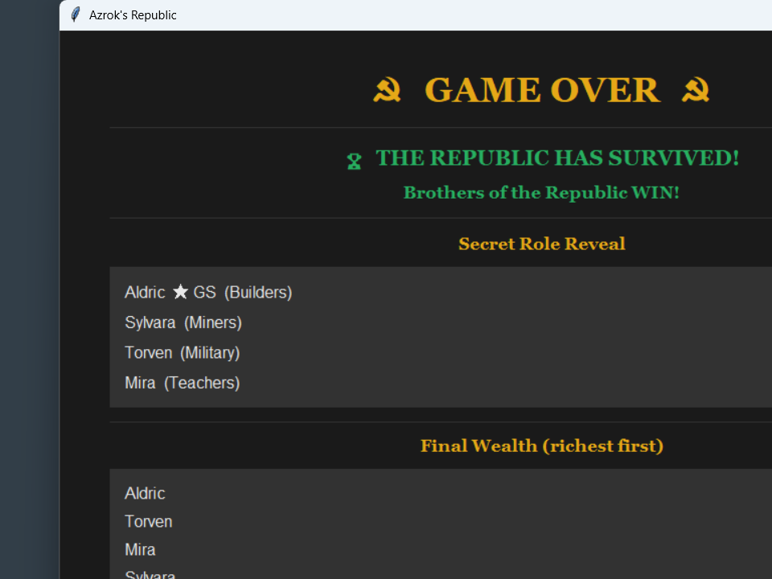 | 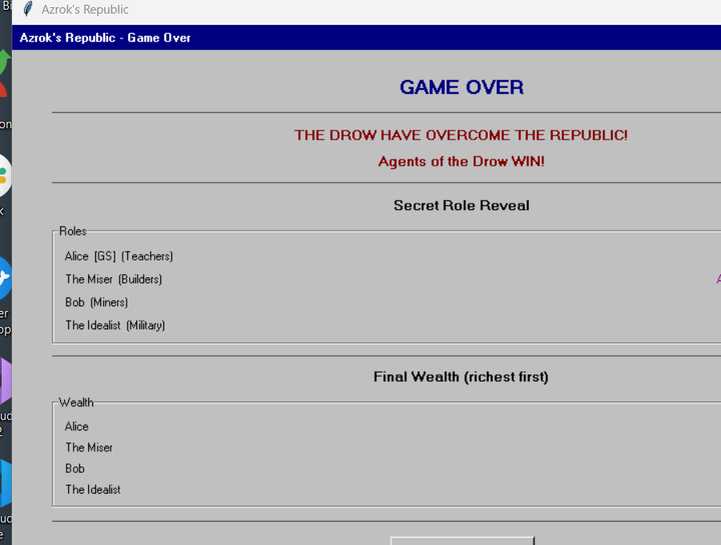 |

### Game Log — Wealth Chart
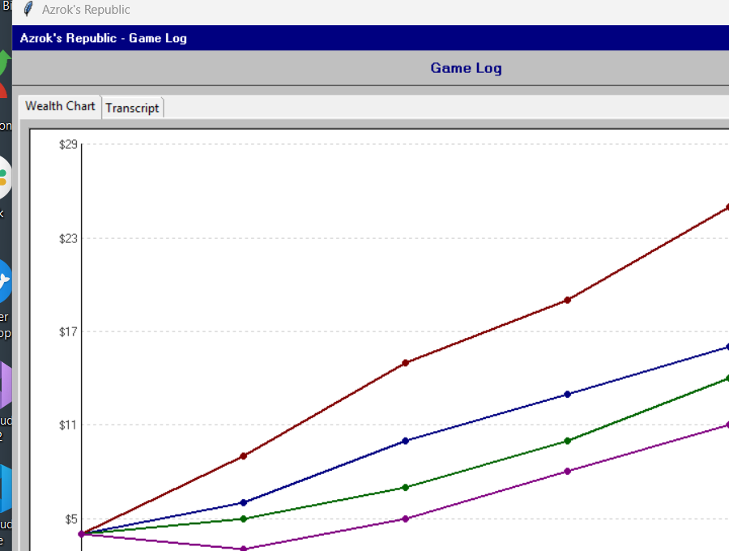

### Game Log — Transcript
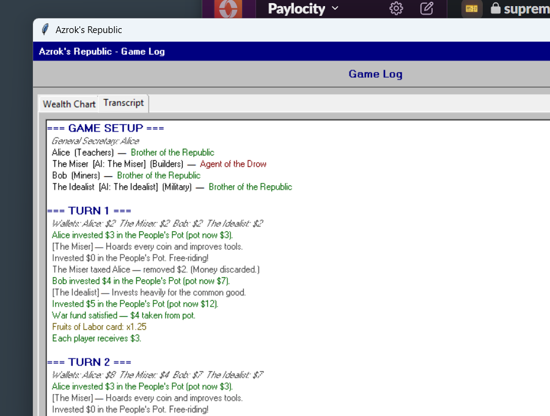

---

## Setup

1. Choose the number of players (2–8).
2. For each slot, enter a name and choose a **Type**:
   - **Human** — a person passes the device for their turn.
   - **AI** — pick a personality from the dropdown; the slot plays automatically.
3. Click **Begin the Republic**.

The game then secretly assigns each player:
- A **sector** (Teachers, Builders, Miners, or Military) — flavour only.
- A **secret role** (revealed privately to human players by passing the device; AI players are assigned silently).
- One player is publicly designated as the **General Secretary**.

---

## AI Players

Any player slot can be set to an AI personality. AI turns resolve automatically and display a log of every decision taken.

| Personality | Style |
|---|---|
| **The Idealist** | Invests nearly all money in the People's Pot. Buys Azrok's Dagger for an instant Republic win if assigned Brother. |
| **The Philanthropist** | Donates everything but $1 to the pot every turn. Never taxes or upgrades tools. |
| **The Pragmatist** | Calculates the war-fund gap and contributes their exact fair share. Upgrades tools when affordable. |
| **The Economist** | Upgrades tools aggressively first for compounding salary gains, then invests the surplus. |
| **The Miser** | Invests nothing. Maxes out tools and taxes the richest rival every turn. |
| **The Wrecker** | Buys Powder Charges to score Drow victories if assigned Agent. Plays cooperatively if assigned Brother. |
| **The Schemer** | Taxes rivals first, then invests about a third of remaining money. Upgrades tools early. |

---

## Secret Roles

| Role | Goal | Count |
|---|---|---|
| **Brother of the Republic** | Keep the war fund supplied for all 10 turns. | Majority |
| **Agent of the Drow** | Let the war fund fail 3 times. | ~1 per 3 players (min. 1) |

Roles are revealed privately before the first turn. Human players see a reveal screen; AI players are assigned silently.

---

## Turn Structure

The game lasts **up to 10 turns**. Each turn proceeds as follows:

### 1. Salary Distribution
Every player receives their salary at the start of the turn.
- Base salary: **$2/turn**.
- Upgrade via **Labor Improvement** (see actions): 1× → 2× → 3× → 4× (costs $7 each, max 3 upgrades).

### 2. Determine Turn Order
The **General Secretary** rolls a die to select the first player. All others follow in seat order; the GS always acts last.

### 3. Player Actions (pass-and-play)
Each human player is handed the device privately. AI players resolve instantly. Three action tabs are available:

#### People's Pot — Invest in the shared war fund
Contribute any amount of your own money to the **People's Pot**.
At end of turn the pot is multiplied by a **Fruits of Labor** card and split equally among *all* players — even those who contributed nothing.
> ⚠️ If no one contributes enough, the war fund requirement may not be met!

#### Special Interests — Private power moves

| Action | Cost | Effect |
|---|---|---|
| **Labor Improvement** | $7 | Increase your salary multiplier by 1 (max 4×). |
| **Powder Charge** | $12 | Blow a hole in the walls — Drow gain **1 victory**. |
| **Azrok's Dagger** | $16 | Bribe the Duergars — Republic wins **immediately**. |

#### Tax — Sabotage a rival
Spend $1 to remove $2 from any other player.
The taxed money is **discarded** (not transferred to you). Usable **once per turn**.

### 4. End-of-Turn Resolution (automatic)

1. **War fund check** — the pot must cover the current turn's war cost:
   | Turns | War cost |
   |---|---|
   | 1–3 | $1 × number of players |
   | 4–6 | $2 × number of players |
   | 7–10 | $3 × number of players |
   - ✅ Cost met → pot reduced by the cost.
   - ❌ Cost not met → **Drow gain a victory**, pot is zeroed.

2. **Fruits of Labor card** — a random multiplier (0.50×–2.50×) is drawn and applied to the remaining pot (rounded up).

3. **Payout** — the pot is divided equally among all players (rounded down); any remainder carries over.

4. **War track** advances to the next turn.

---

## Win Conditions

| Winner | Condition |
|---|---|
| **Republic** | Survive all 10 turns with fewer than 3 Drow victories, **or** a player buys Azrok's Dagger. |
| **Drow** | The war fund fails **3 times** (including via Powder Charges). |

At game over, all secret roles are publicly revealed alongside the final wealth ranking.

---

## Game Log

After the game ends, click **View Game Log** to open a two-tab log screen:

- **Wealth Chart** — a colour-coded line graph of every player's money at the start of each turn.
- **Transcript** — a scrollable turn-by-turn record of every action taken, colour-coded by outcome (green = positive, red = damaging, grey = neutral).

---

## Strategy Tips

- **Brothers** should invest heavily in the People's Pot, especially in later turns when the war cost scales up.
- **Agents** can free-ride, use Tax to drain reliable contributors, or risk blowing their cover with a Powder Charge.
- **Labor Improvement** is a personal investment — great for wealth but every dollar spent is a dollar not going to the war fund.
- **Azrok's Dagger** is an instant win for whoever can afford it — a strong incentive to hoard money.
- Watch the **Wealth Chart** after the game to spot who was hoarding while others contributed.

---

## File Overview

| File | Description |
|---|---|
| `azroks_republic.py` | Full game source (data model, UI, game logic, AI players). |
| `play_azroks_republic.bat` | Windows launcher — double-click to start. |
| `build_exe.bat` | Builds `build\AzroksRepublic.exe` via PyInstaller. |
| `build\AzroksRepublic.exe` | Pre-built Windows executable. |
